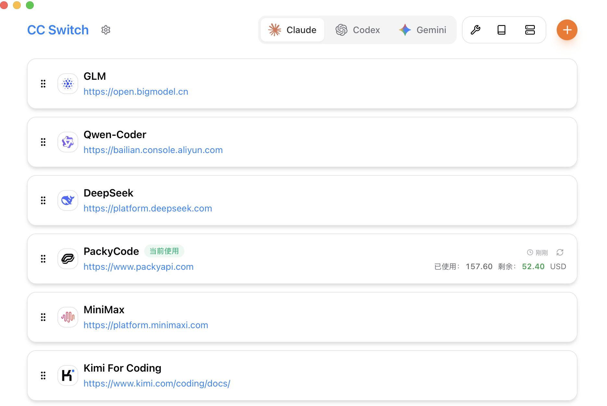

# 02：CC Switch 下载与安装

CC Switch 是管理 Claude Code、Codex、Gemini CLI、OpenCode 等客户端供应商配置的桌面工具。只从官方渠道下载：

- [ccswitch.io](https://ccswitch.io)
- [GitHub Releases](https://github.com/farion1231/cc-switch/releases)
- [GitHub 源码仓库](https://github.com/farion1231/cc-switch)

任何要求为“CC Switch 本体”付费、充值或交出账号密码的网站都不是官方渠道。

## Windows 10/11

1. 打开 Releases。
2. 普通电脑下载 `CC-Switch-v版本-Windows.msi`。
3. 不想安装可下载 `CC-Switch-v版本-Windows-Portable.zip`，解压后运行 `CC-Switch.exe`。
4. 如果双击 MSI 没反应：右键文件 → 属性 → 常规 → 勾选“解除锁定”。
5. 安装后从开始菜单启动，确认系统托盘出现 CC Switch 图标。

Windows ARM 设备选择带 `Windows-arm64` 的文件，不要下载 x64 版本。

## macOS

推荐 Homebrew：

```bash
brew install --cask cc-switch
```

更新：

```bash
brew upgrade --cask cc-switch
```

也可从 Releases 下载 `macOS.dmg`，打开后拖到“应用程序”。官方文档说明 macOS 版本已签名并公证。

## Linux

Ubuntu/Debian 下载 `.deb`：

```bash
sudo dpkg -i CC-Switch-v版本-Linux-*.deb
sudo apt-get install -f
```

通用 AppImage：

```bash
chmod +x CC-Switch-v版本-Linux-*.AppImage
./CC-Switch-v版本-Linux-*.AppImage
```

Arch Linux：

```bash
paru -S cc-switch-bin
```

## 安装 Codex 或 Claude Code

CC Switch 管理配置，但要实际聊天/编程仍需安装对应 CLI。建议 Node.js 18 或更高版本。

```powershell
node --version
npm --version
npm install -g @openai/codex
npm install -g @anthropic-ai/claude-code
```

国内下载慢可在单次安装时添加：

```powershell
npm install -g @openai/codex --registry=https://registry.npmmirror.com
```

## 认识主界面



1. 顶部 Claude / Codex / Gemini 是“你正在管理哪个客户端”。
2. 右上角 `+` 用来添加供应商。
3. 供应商卡片悬停后可见启用、编辑、复制、测速、用量和删除按钮。
4. Codex 切换供应商后通常需要完全退出并重新打开终端/Codex。

## 安装验证

完成以下检查即可进入下一章：

- CC Switch 能正常打开。
- 系统托盘有图标。
- 顶部能切换到 `Codex` 或 `Claude`。
- `codex --version` 或 `claude --version` 能显示版本。

